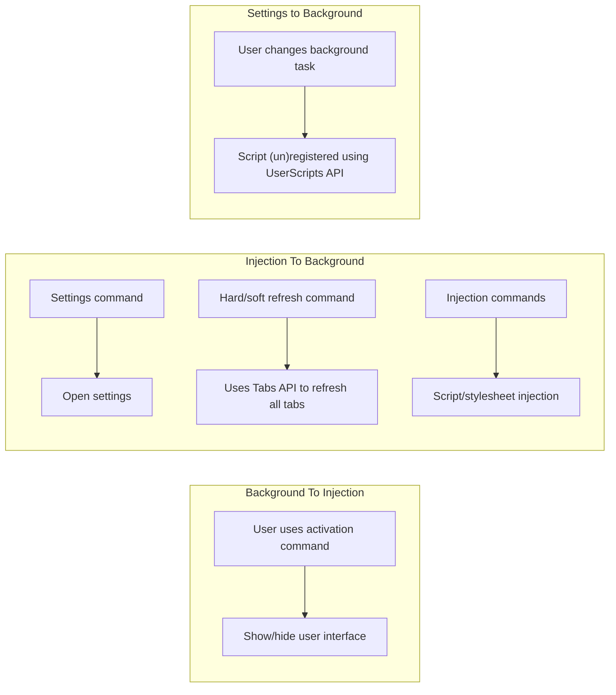

# kestrel

General browser utilities.


There's not much implemented right now, and what is is somewhat simplistic.  More complicated features are coming.

The extension hasn't been submitted to FireFox addons just yet, but once some of the markers in the roadmap are hit and a lot more commands/features are added, it will be.  Stability also needs to be improved before I'll submit it.

## Table of Contents

+ [Features](#features)
+ [FAQ](#faq)
+ [Usage](#usage)
+ [Screenshots](#screenshots)
+ [Roadmap](#roadmap)
+ [Changelog](#changelog)
+ [Docs](#docs)
+ [Motivation](#motivation)
+ [License](#license)

## Features

TODO: Update

+ Disable all links [none]
+ Hide media (images/video) [none]
+ Open all links in the same tab [none]
+ Refresh tabs [tabs]
+ Scroll to *x* [none]
+ Show media (images/video) [none]
+ Toggle animations [none]
+ Edit page [none] {in-progress}
+ Mini-map [none] {in-progress}

## FAQ

TODO: Finish section

### How Are Permissions Used

The [features](#features) section lists the permissions that each feature uses.

TODO: General overview of how permissions are used

### How Do I Change Kestrel's Default Activation Command

See [this article](https://support.mozilla.org/en-US/kb/manage-extension-shortcuts-firefox) from Mozilla.

## Usage

Kestrel is currently not listed on any addons store, and it will stay that way until **at least** 1.0.  The current version can be found in the `version` key of the [manifest](https://github.com/EthanJustice/kestrel/blob/master/src/manifest.json).

There's not much to see right now.  The main part is activated with `Alt+Shift+Q`.  Why Q?  All the keys can be hit with one hand.

### Development

1. Download Kestrel
2. Go to `about:debugging`
3. Click on `This Firefox`
4. Click on `Load Temporary Add-on...`
5. Navigate to wherever you downloaded Kestrel and open `src/manifest.json` in the prompt
6. You're good to go!

## Screenshots

TODO: Finish section

## Roadmap

+ Performance Testing with **about:performance** [meta]
+ Better docs (diagrams, etc.) [meta]

### High

+ Security [bug] {in-progress}
+ Anti-fingerprinting

### Medium

+ Refactoring [meta]
+ Better onboarding/user-friendly docs [meta] {in-progress}
+ Homepage [meta] {in-progress}
+ Customisation of highlight colour [feature]
+ Better mini-map styling [bug]
+ Move `src/cs/automatic` to `src/injections/automatic` [meta]
+ Doc updates [meta]
+ Move `src/cs/automatic` to `src/injections/automatic` [meta]

### Low

+ Fix injection styling inconsistencies [bug] {in-progress}

### Abandoned/Ultra-Low Priority

+ ~~User-set activation/close command [feature]~~ [abandoned - see [](https://github.com/EthanJustice/kestrel/)]
+ Dynamic permission requests [feature] (see [here](https://developer.mozilla.org/en-US/docs/Mozilla/Add-ons/WebExtensions/manifest.json/optional_permissions) for all permissions that can be requested dynamically - of these, only a few are not needed automatically)

I also have a list of other features I'm working on that I'll port over when I can.

## Changelog

### v1.0

+ Switched from injection-based approach to a browser-action-based approach
+ Some internal updates

## Docs

File structure

```plaintext
readme.md - meta information
license - MIT
    /meta/ - meta
        /icon - icon generation files
            index.html - icon generation
    /src/ - extension
        manifest.json - WebExtension manifest
        /background - background scripts
            main.js - primary background script, controls injection logic
            scriptApi.js - userscript API
        /cs - content scripts
            /automatic - automatic content scripts, injected at page load
            kestrel.js - logic for commands
            ui.css - styling for command palette
            ui.js - logic for command palette
        /icons - kestrel icons
        /injections - files for commands that require injections
            /minimap - injection files for minimap command
        /libs - libraries and files used across multiple folders
            commands.js - list of commands, aliases, and callbacks
            index.css - base stylesheet for all pages
            taita.js - command palette logic processor
            utils.js - utility
            /themes - various themes
        /pages
            /settings - extension settings page
                index.html - settings page
                settings.css - form styling, some stlying specific to /settings
                settings.js - object with settings, descriptions, etc.
                update.js - settings page logic
            /media - images
            /guide - kestrel guide
            /reference - kestrel reference
        /themes - reusable themes
            dark.css - dark theme variables
            light.css - light theme variables
```

Messaging between extension parts

[![](https://mermaid.ink/img/eyJjb2RlIjoiZ3JhcGggTFJcbiAgc3ViZ3JhcGggQmFja2dyb3VuZCBUbyBJbmplY3Rpb25cbiAgICBjbWRbXCJVc2VyIHVzZXMgYWN0aXZhdGlvbiBjb21tYW5kXCJdIC0tPiB1aVtcIlNob3cvaGlkZSB1c2VyIGludGVyZmFjZVwiXVxuICBlbmRcbiAgc3ViZ3JhcGggSW5qZWN0aW9uIFRvIEJhY2tncm91bmRcbiAgICBjW1wiU2V0dGluZ3MgY29tbWFuZFwiXSAtLT4gc1tcIk9wZW4gc2V0dGluZ3NcIl1cbiAgICByZWZbXCJIYXJkL3NvZnQgcmVmcmVzaCBjb21tYW5kXCJdIC0tPiBwW1wiVXNlcyBUYWJzIEFQSSB0byByZWZyZXNoIGFsbCB0YWJzXCJdXG4gICAgaW5qW1wiSW5qZWN0aW9uIGNvbW1hbmRzXCJdIC0tPiBlW1wiU2NyaXB0L3N0eWxlc2hlZXQgaW5qZWN0aW9uXCJdXG4gIGVuZFxuICBzdWJncmFwaCBTZXR0aW5ncyB0byBCYWNrZ3JvdW5kXG4gICAgc3RiW1wiVXNlciBjaGFuZ2VzIGJhY2tncm91bmQgdGFza1wiXSAtLT4gdXNbXCJTY3JpcHQgKHVuKXJlZ2lzdGVyZWQgdXNpbmcgVXNlclNjcmlwdHMgQVBJXCJdXG4gIGVuZCIsIm1lcm1haWQiOnsidGhlbWUiOiJkYXJrIiwidGhlbWVWYXJpYWJsZXMiOnsiYmFja2dyb3VuZCI6IiMzMzMiLCJwcmltYXJ5Q29sb3IiOiIjMWYyMDIwIiwic2Vjb25kYXJ5Q29sb3IiOiJoc2woMTgwLCAxLjU4NzMwMTU4NzMlLCAyOC4zNTI5NDExNzY1JSkiLCJ0ZXJ0aWFyeUNvbG9yIjoiaHNsKDIwLCAxLjU4NzMwMTU4NzMlLCAxMi4zNTI5NDExNzY1JSkiLCJwcmltYXJ5Qm9yZGVyQ29sb3IiOiJoc2woMTgwLCAwJSwgMi4zNTI5NDExNzY1JSkiLCJzZWNvbmRhcnlCb3JkZXJDb2xvciI6ImhzbCgxODAsIDAlLCAxOC4zNTI5NDExNzY1JSkiLCJ0ZXJ0aWFyeUJvcmRlckNvbG9yIjoiaHNsKDIwLCAwJSwgMi4zNTI5NDExNzY1JSkiLCJwcmltYXJ5VGV4dENvbG9yIjoiI2UwZGZkZiIsInNlY29uZGFyeVRleHRDb2xvciI6InJnYigxODMuODQ3NjE5MDQ3NSwgMTgxLjU1MjM4MDk1MjMsIDE4MS41NTIzODA5NTIzKSIsInRlcnRpYXJ5VGV4dENvbG9yIjoicmdiKDIyMi45OTk5OTk5OTk5LCAyMjMuNjY2NjY2NjY2NiwgMjIzLjk5OTk5OTk5OTkpIiwibGluZUNvbG9yIjoibGlnaHRncmV5IiwidGV4dENvbG9yIjoiI2NjYyIsIm1haW5Ca2ciOiIjMWYyMDIwIiwic2Vjb25kQmtnIjoiaHNsKDE4MCwgMS41ODczMDE1ODczJSwgMjguMzUyOTQxMTc2NSUpIiwibWFpbkNvbnRyYXN0Q29sb3IiOiJsaWdodGdyZXkiLCJkYXJrVGV4dENvbG9yIjoiaHNsKDI4LjU3MTQyODU3MTQsIDE3LjM1NTM3MTkwMDglLCA4Ni4yNzQ1MDk4MDM5JSkiLCJib3JkZXIxIjoiIzgxQjFEQiIsImJvcmRlcjIiOiJyZ2JhKDI1NSwgMjU1LCAyNTUsIDAuMjUpIiwiYXJyb3doZWFkQ29sb3IiOiJsaWdodGdyZXkiLCJmb250RmFtaWx5IjoiXCJ0cmVidWNoZXQgbXNcIiwgdmVyZGFuYSwgYXJpYWwiLCJmb250U2l6ZSI6IjE2cHgiLCJsYWJlbEJhY2tncm91bmQiOiIjMTgxODE4Iiwibm9kZUJrZyI6IiMxZjIwMjAiLCJub2RlQm9yZGVyIjoiIzgxQjFEQiIsImNsdXN0ZXJCa2ciOiJoc2woMTgwLCAxLjU4NzMwMTU4NzMlLCAyOC4zNTI5NDExNzY1JSkiLCJjbHVzdGVyQm9yZGVyIjoicmdiYSgyNTUsIDI1NSwgMjU1LCAwLjI1KSIsImRlZmF1bHRMaW5rQ29sb3IiOiJsaWdodGdyZXkiLCJ0aXRsZUNvbG9yIjoiI0Y5RkZGRSIsImVkZ2VMYWJlbEJhY2tncm91bmQiOiJoc2woMCwgMCUsIDM0LjQxMTc2NDcwNTklKSIsImFjdG9yQm9yZGVyIjoiIzgxQjFEQiIsImFjdG9yQmtnIjoiIzFmMjAyMCIsImFjdG9yVGV4dENvbG9yIjoibGlnaHRncmV5IiwiYWN0b3JMaW5lQ29sb3IiOiJsaWdodGdyZXkiLCJzaWduYWxDb2xvciI6ImxpZ2h0Z3JleSIsInNpZ25hbFRleHRDb2xvciI6ImxpZ2h0Z3JleSIsImxhYmVsQm94QmtnQ29sb3IiOiIjMWYyMDIwIiwibGFiZWxCb3hCb3JkZXJDb2xvciI6IiM4MUIxREIiLCJsYWJlbFRleHRDb2xvciI6ImxpZ2h0Z3JleSIsImxvb3BUZXh0Q29sb3IiOiJsaWdodGdyZXkiLCJub3RlQm9yZGVyQ29sb3IiOiJyZ2JhKDI1NSwgMjU1LCAyNTUsIDAuMjUpIiwibm90ZUJrZ0NvbG9yIjoiI2ZmZjVhZCIsIm5vdGVUZXh0Q29sb3IiOiIjMWYyMDIwIiwiYWN0aXZhdGlvbkJvcmRlckNvbG9yIjoiIzgxQjFEQiIsImFjdGl2YXRpb25Ca2dDb2xvciI6ImhzbCgxODAsIDEuNTg3MzAxNTg3MyUsIDI4LjM1Mjk0MTE3NjUlKSIsInNlcXVlbmNlTnVtYmVyQ29sb3IiOiJibGFjayIsInNlY3Rpb25Ca2dDb2xvciI6ImhzbCg1Mi45NDExNzY0NzA2LCAyOC44MTM1NTkzMjIlLCA1OC40MzEzNzI1NDklKSIsImFsdFNlY3Rpb25Ca2dDb2xvciI6IiMzMzMiLCJzZWN0aW9uQmtnQ29sb3IyIjoiI0VBRThEOSIsInRhc2tCb3JkZXJDb2xvciI6IiNmZmZmZmYiLCJ0YXNrQmtnQ29sb3IiOiJoc2woMTgwLCAxLjU4NzMwMTU4NzMlLCAzNS4zNTI5NDExNzY1JSkiLCJ0YXNrVGV4dENvbG9yIjoiaHNsKDI4LjU3MTQyODU3MTQsIDE3LjM1NTM3MTkwMDglLCA4Ni4yNzQ1MDk4MDM5JSkiLCJ0YXNrVGV4dExpZ2h0Q29sb3IiOiJsaWdodGdyZXkiLCJ0YXNrVGV4dE91dHNpZGVDb2xvciI6ImxpZ2h0Z3JleSIsInRhc2tUZXh0Q2xpY2thYmxlQ29sb3IiOiIjMDAzMTYzIiwiYWN0aXZlVGFza0JvcmRlckNvbG9yIjoiI2ZmZmZmZiIsImFjdGl2ZVRhc2tCa2dDb2xvciI6IiM4MUIxREIiLCJncmlkQ29sb3IiOiJsaWdodGdyZXkiLCJkb25lVGFza0JrZ0NvbG9yIjoibGlnaHRncmV5IiwiZG9uZVRhc2tCb3JkZXJDb2xvciI6ImdyZXkiLCJjcml0Qm9yZGVyQ29sb3IiOiIjRTgzNzM3IiwiY3JpdEJrZ0NvbG9yIjoiI0U4MzczNyIsInRhc2tUZXh0RGFya0NvbG9yIjoiaHNsKDI4LjU3MTQyODU3MTQsIDE3LjM1NTM3MTkwMDglLCA4Ni4yNzQ1MDk4MDM5JSkiLCJ0b2RheUxpbmVDb2xvciI6IiNEQjU3NTciLCJsYWJlbENvbG9yIjoiI2NjYyIsImVycm9yQmtnQ29sb3IiOiIjYTQ0MTQxIiwiZXJyb3JUZXh0Q29sb3IiOiIjZGRkIiwiYWx0QmFja2dyb3VuZCI6ImhzbCgwLCAwJSwgNDAlKSIsImZpbGxUeXBlMCI6IiMxZjIwMjAiLCJmaWxsVHlwZTEiOiJoc2woMTgwLCAxLjU4NzMwMTU4NzMlLCAyOC4zNTI5NDExNzY1JSkiLCJmaWxsVHlwZTIiOiJoc2woMjQ0LCAxLjU4NzMwMTU4NzMlLCAxMi4zNTI5NDExNzY1JSkiLCJmaWxsVHlwZTMiOiJoc2woMjQ0LCAxLjU4NzMwMTU4NzMlLCAyOC4zNTI5NDExNzY1JSkiLCJmaWxsVHlwZTQiOiJoc2woMTE2LCAxLjU4NzMwMTU4NzMlLCAxMi4zNTI5NDExNzY1JSkiLCJmaWxsVHlwZTUiOiJoc2woMTE2LCAxLjU4NzMwMTU4NzMlLCAyOC4zNTI5NDExNzY1JSkiLCJmaWxsVHlwZTYiOiJoc2woMzA4LCAxLjU4NzMwMTU4NzMlLCAxMi4zNTI5NDExNzY1JSkiLCJmaWxsVHlwZTciOiJoc2woMzA4LCAxLjU4NzMwMTU4NzMlLCAyOC4zNTI5NDExNzY1JSkiLCJjbGFzc1RleHQiOiIjZTBkZmRmIn19LCJ1cGRhdGVFZGl0b3IiOmZhbHNlfQ)](https://mermaid-js.github.io/mermaid-live-editor/#/edit/eyJjb2RlIjoiZ3JhcGggTFJcbiAgc3ViZ3JhcGggQmFja2dyb3VuZCBUbyBJbmplY3Rpb25cbiAgICBjbWRbXCJVc2VyIHVzZXMgYWN0aXZhdGlvbiBjb21tYW5kXCJdIC0tPiB1aVtcIlNob3cvaGlkZSB1c2VyIGludGVyZmFjZVwiXVxuICBlbmRcbiAgc3ViZ3JhcGggSW5qZWN0aW9uIFRvIEJhY2tncm91bmRcbiAgICBjW1wiU2V0dGluZ3MgY29tbWFuZFwiXSAtLT4gc1tcIk9wZW4gc2V0dGluZ3NcIl1cbiAgICByZWZbXCJIYXJkL3NvZnQgcmVmcmVzaCBjb21tYW5kXCJdIC0tPiBwW1wiVXNlcyBUYWJzIEFQSSB0byByZWZyZXNoIGFsbCB0YWJzXCJdXG4gICAgaW5qW1wiSW5qZWN0aW9uIGNvbW1hbmRzXCJdIC0tPiBlW1wiU2NyaXB0L3N0eWxlc2hlZXQgaW5qZWN0aW9uXCJdXG4gIGVuZFxuICBzdWJncmFwaCBTZXR0aW5ncyB0byBCYWNrZ3JvdW5kXG4gICAgc3RiW1wiVXNlciBjaGFuZ2VzIGJhY2tncm91bmQgdGFza1wiXSAtLT4gdXNbXCJTY3JpcHQgKHVuKXJlZ2lzdGVyZWQgdXNpbmcgVXNlclNjcmlwdHMgQVBJXCJdXG4gIGVuZCIsIm1lcm1haWQiOnsidGhlbWUiOiJkYXJrIiwidGhlbWVWYXJpYWJsZXMiOnsiYmFja2dyb3VuZCI6IiMzMzMiLCJwcmltYXJ5Q29sb3IiOiIjMWYyMDIwIiwic2Vjb25kYXJ5Q29sb3IiOiJoc2woMTgwLCAxLjU4NzMwMTU4NzMlLCAyOC4zNTI5NDExNzY1JSkiLCJ0ZXJ0aWFyeUNvbG9yIjoiaHNsKDIwLCAxLjU4NzMwMTU4NzMlLCAxMi4zNTI5NDExNzY1JSkiLCJwcmltYXJ5Qm9yZGVyQ29sb3IiOiJoc2woMTgwLCAwJSwgMi4zNTI5NDExNzY1JSkiLCJzZWNvbmRhcnlCb3JkZXJDb2xvciI6ImhzbCgxODAsIDAlLCAxOC4zNTI5NDExNzY1JSkiLCJ0ZXJ0aWFyeUJvcmRlckNvbG9yIjoiaHNsKDIwLCAwJSwgMi4zNTI5NDExNzY1JSkiLCJwcmltYXJ5VGV4dENvbG9yIjoiI2UwZGZkZiIsInNlY29uZGFyeVRleHRDb2xvciI6InJnYigxODMuODQ3NjE5MDQ3NSwgMTgxLjU1MjM4MDk1MjMsIDE4MS41NTIzODA5NTIzKSIsInRlcnRpYXJ5VGV4dENvbG9yIjoicmdiKDIyMi45OTk5OTk5OTk5LCAyMjMuNjY2NjY2NjY2NiwgMjIzLjk5OTk5OTk5OTkpIiwibGluZUNvbG9yIjoibGlnaHRncmV5IiwidGV4dENvbG9yIjoiI2NjYyIsIm1haW5Ca2ciOiIjMWYyMDIwIiwic2Vjb25kQmtnIjoiaHNsKDE4MCwgMS41ODczMDE1ODczJSwgMjguMzUyOTQxMTc2NSUpIiwibWFpbkNvbnRyYXN0Q29sb3IiOiJsaWdodGdyZXkiLCJkYXJrVGV4dENvbG9yIjoiaHNsKDI4LjU3MTQyODU3MTQsIDE3LjM1NTM3MTkwMDglLCA4Ni4yNzQ1MDk4MDM5JSkiLCJib3JkZXIxIjoiIzgxQjFEQiIsImJvcmRlcjIiOiJyZ2JhKDI1NSwgMjU1LCAyNTUsIDAuMjUpIiwiYXJyb3doZWFkQ29sb3IiOiJsaWdodGdyZXkiLCJmb250RmFtaWx5IjoiXCJ0cmVidWNoZXQgbXNcIiwgdmVyZGFuYSwgYXJpYWwiLCJmb250U2l6ZSI6IjE2cHgiLCJsYWJlbEJhY2tncm91bmQiOiIjMTgxODE4Iiwibm9kZUJrZyI6IiMxZjIwMjAiLCJub2RlQm9yZGVyIjoiIzgxQjFEQiIsImNsdXN0ZXJCa2ciOiJoc2woMTgwLCAxLjU4NzMwMTU4NzMlLCAyOC4zNTI5NDExNzY1JSkiLCJjbHVzdGVyQm9yZGVyIjoicmdiYSgyNTUsIDI1NSwgMjU1LCAwLjI1KSIsImRlZmF1bHRMaW5rQ29sb3IiOiJsaWdodGdyZXkiLCJ0aXRsZUNvbG9yIjoiI0Y5RkZGRSIsImVkZ2VMYWJlbEJhY2tncm91bmQiOiJoc2woMCwgMCUsIDM0LjQxMTc2NDcwNTklKSIsImFjdG9yQm9yZGVyIjoiIzgxQjFEQiIsImFjdG9yQmtnIjoiIzFmMjAyMCIsImFjdG9yVGV4dENvbG9yIjoibGlnaHRncmV5IiwiYWN0b3JMaW5lQ29sb3IiOiJsaWdodGdyZXkiLCJzaWduYWxDb2xvciI6ImxpZ2h0Z3JleSIsInNpZ25hbFRleHRDb2xvciI6ImxpZ2h0Z3JleSIsImxhYmVsQm94QmtnQ29sb3IiOiIjMWYyMDIwIiwibGFiZWxCb3hCb3JkZXJDb2xvciI6IiM4MUIxREIiLCJsYWJlbFRleHRDb2xvciI6ImxpZ2h0Z3JleSIsImxvb3BUZXh0Q29sb3IiOiJsaWdodGdyZXkiLCJub3RlQm9yZGVyQ29sb3IiOiJyZ2JhKDI1NSwgMjU1LCAyNTUsIDAuMjUpIiwibm90ZUJrZ0NvbG9yIjoiI2ZmZjVhZCIsIm5vdGVUZXh0Q29sb3IiOiIjMWYyMDIwIiwiYWN0aXZhdGlvbkJvcmRlckNvbG9yIjoiIzgxQjFEQiIsImFjdGl2YXRpb25Ca2dDb2xvciI6ImhzbCgxODAsIDEuNTg3MzAxNTg3MyUsIDI4LjM1Mjk0MTE3NjUlKSIsInNlcXVlbmNlTnVtYmVyQ29sb3IiOiJibGFjayIsInNlY3Rpb25Ca2dDb2xvciI6ImhzbCg1Mi45NDExNzY0NzA2LCAyOC44MTM1NTkzMjIlLCA1OC40MzEzNzI1NDklKSIsImFsdFNlY3Rpb25Ca2dDb2xvciI6IiMzMzMiLCJzZWN0aW9uQmtnQ29sb3IyIjoiI0VBRThEOSIsInRhc2tCb3JkZXJDb2xvciI6IiNmZmZmZmYiLCJ0YXNrQmtnQ29sb3IiOiJoc2woMTgwLCAxLjU4NzMwMTU4NzMlLCAzNS4zNTI5NDExNzY1JSkiLCJ0YXNrVGV4dENvbG9yIjoiaHNsKDI4LjU3MTQyODU3MTQsIDE3LjM1NTM3MTkwMDglLCA4Ni4yNzQ1MDk4MDM5JSkiLCJ0YXNrVGV4dExpZ2h0Q29sb3IiOiJsaWdodGdyZXkiLCJ0YXNrVGV4dE91dHNpZGVDb2xvciI6ImxpZ2h0Z3JleSIsInRhc2tUZXh0Q2xpY2thYmxlQ29sb3IiOiIjMDAzMTYzIiwiYWN0aXZlVGFza0JvcmRlckNvbG9yIjoiI2ZmZmZmZiIsImFjdGl2ZVRhc2tCa2dDb2xvciI6IiM4MUIxREIiLCJncmlkQ29sb3IiOiJsaWdodGdyZXkiLCJkb25lVGFza0JrZ0NvbG9yIjoibGlnaHRncmV5IiwiZG9uZVRhc2tCb3JkZXJDb2xvciI6ImdyZXkiLCJjcml0Qm9yZGVyQ29sb3IiOiIjRTgzNzM3IiwiY3JpdEJrZ0NvbG9yIjoiI0U4MzczNyIsInRhc2tUZXh0RGFya0NvbG9yIjoiaHNsKDI4LjU3MTQyODU3MTQsIDE3LjM1NTM3MTkwMDglLCA4Ni4yNzQ1MDk4MDM5JSkiLCJ0b2RheUxpbmVDb2xvciI6IiNEQjU3NTciLCJsYWJlbENvbG9yIjoiI2NjYyIsImVycm9yQmtnQ29sb3IiOiIjYTQ0MTQxIiwiZXJyb3JUZXh0Q29sb3IiOiIjZGRkIiwiYWx0QmFja2dyb3VuZCI6ImhzbCgwLCAwJSwgNDAlKSIsImZpbGxUeXBlMCI6IiMxZjIwMjAiLCJmaWxsVHlwZTEiOiJoc2woMTgwLCAxLjU4NzMwMTU4NzMlLCAyOC4zNTI5NDExNzY1JSkiLCJmaWxsVHlwZTIiOiJoc2woMjQ0LCAxLjU4NzMwMTU4NzMlLCAxMi4zNTI5NDExNzY1JSkiLCJmaWxsVHlwZTMiOiJoc2woMjQ0LCAxLjU4NzMwMTU4NzMlLCAyOC4zNTI5NDExNzY1JSkiLCJmaWxsVHlwZTQiOiJoc2woMTE2LCAxLjU4NzMwMTU4NzMlLCAxMi4zNTI5NDExNzY1JSkiLCJmaWxsVHlwZTUiOiJoc2woMTE2LCAxLjU4NzMwMTU4NzMlLCAyOC4zNTI5NDExNzY1JSkiLCJmaWxsVHlwZTYiOiJoc2woMzA4LCAxLjU4NzMwMTU4NzMlLCAxMi4zNTI5NDExNzY1JSkiLCJmaWxsVHlwZTciOiJoc2woMzA4LCAxLjU4NzMwMTU4NzMlLCAyOC4zNTI5NDExNzY1JSkiLCJjbGFzc1RleHQiOiIjZTBkZmRmIn19LCJ1cGRhdGVFZGl0b3IiOmZhbHNlfQ)

[[Raw Mermaid]]



Extension storage (all are customised in the options page)

```plaintext
automatic - automatic tasks, and whether they're enabled

automaticsettings - settings for automatic tasks

commands - all commands, and whether they're enabled

theme - string - kestrel's theme (light, dark, or operating-system-default, which uses the (prefers-color-scheme) media query)
```

## Motivation

Kestrel is simply a collection of utilities that I wished browsers included (and they may, I probably just didn't find them), wrapped in convenience (as opposed to several hundred small UserScripts).  I've built it to present as little overhead on general performance as possible, but there's still much to be done.

## License

MIT
