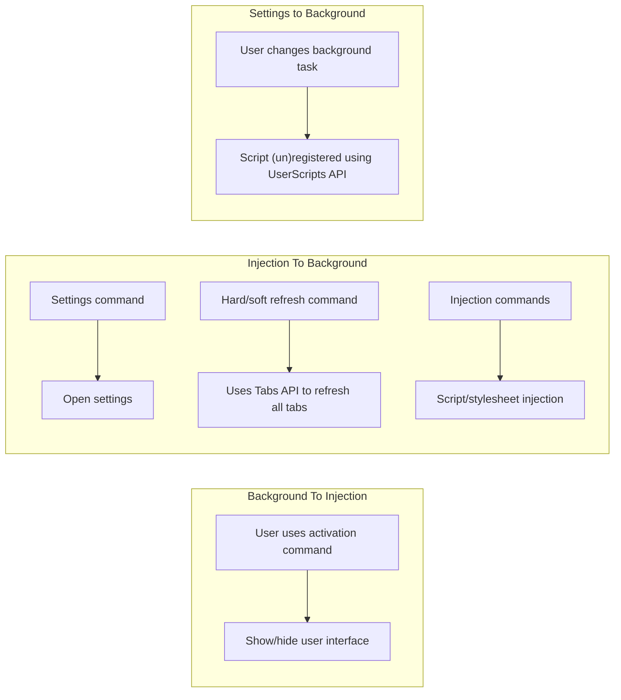

# kestrel

General browser utilities.


The extension hasn't been submitted to FireFox addons just yet, but you can track it [from the AMO project](https://github.com/EthanJustice/kestrel/projects/1).

## Table of Contents

+ [Features](#features)
+ [FAQ](#faq)
  + [How Are Permissions Used?](#how-are-permissions-used)
  + [How Do I Change Kestrel's Default Activation Command?](#how-do-i-change-kestrels-default-activation-command)
+ [Usage](#usage)
  + [Development](#development)
+ [Screenshots](#screenshots)
+ [Roadmap](#roadmap)
  + [High Priority](#high)
  + [Medium Priority](#medium)
  + [Low Priority](#low)
  + [Planned Features](#planned-features)
+ [Changelog](#changelog)
  + [v1.0](#v1.0)
+ [Docs](#docs)
  + [Kestrel Query Language](#kestrel-query-language)
+ [Motivation](#motivation)
+ [License](#license)

## Features

TODO: Update
[x] represents APIs utilised to make the feature work.

+ Disable all links, to prevent yourself from going down an internet rabbit hole [none]
+ Hide media (images/video) [none]
+ Open all links in the same tab [none]
+ Refresh tabs [tabs]
+ Scroll to *x* [none]
+ Show media (images/video) [none]
+ Toggle animations [none]
+ Edit page [none] {in-progress}
+ Mini-map [none] {in-progress}
+ Image manipulation utilities on `.png`, `.jpeg`, and `.jpg` images [none] {in-progress} 

## FAQ

TODO: Finish section

### How Are Permissions Used

The [features](#features) section lists the permissions that each feature uses.

TODO: General overview of how permissions are used

TODO: instances of permission usage, e.g. [https://github.com/EthanJustice/kestrel/search?q=browser.tabs.&unscoped_q=browser.tabs.](https://github.com/EthanJustice/kestrel/search?q=browser.tabs.&unscoped_q=browser.tabs.)

### How Do I Change Kestrel's Default Activation Command

See [this article](https://support.mozilla.org/en-US/kb/manage-extension-shortcuts-firefox) from Mozilla.

### Does Kestrel Collect Analytics or Data of Any Kind

No, not now and not ever.

### I Don't Understand Something

Your best bet is the [wiki](https://github.com/EthanJustice/kestrel/wiki).

## Usage

There's not much to see right now.  The main part is activated with `Alt+Shift+A`.  Why `Alt+Shift+A`?  All the keys can be hit with one hand.

### Development

1. Download Kestrel
2. Go to `about:debugging`
3. Click on `This Firefox`
4. Click on `Load Temporary Add-on...`
5. Navigate to wherever you downloaded Kestrel and open `src/manifest.json` in the prompt
6. You're good to go!

Please use [`web-ext`](https://github.com/mozilla/web-ext) for linting.

## Screenshots


TODO: Finish section

## Roadmap

+ Performance Testing with **about:performance** [meta]
+ Possible WASM porting
+ Things for AMO release (user docs, copy, etc.)
+ Update version

### General

#### High

+ Security [bug] {in-progress}
+ Anti-fingerprinting
+ Tests [meta]
+ AMO meta [meta]
+ Project meta [meta]

#### Medium

+ Finish timer integration ([timer-dev](https://github.com/EthanJustice/kestrel/tree/timer-dev))
+ Rename KQL
+ Update features [meta]
+ Finish image filtering utilities
  + Cropping
  + Rotation
  + Toolbar styling
+ Refactoring [meta]
+ Better onboarding/user-friendly docs [meta] {in-progress}

#### Low

+ Better docs (diagrams, etc.) [meta]
+ Logical ordering of variables and whatnot [meta]
+ Homepage [meta] {in-progress}
+ Better icons
  + Different icons for `page-action` and `browser-action`

#### Planned Features

+ Add hide media into background task [background]
+ Arrange tabs by title and url (maybe others, e.g. `most text`?) [browser-action]
+ Timers ([alarms - Mozilla | MDN](https://developer.mozilla.org/en-US/docs/Mozilla/Add-ons/WebExtensions/API/alarms)) [browser-action] {in-progress}
+ Minimal mode - basic stylesheet (customisable), table of contents, small amount of site metadata (similar to reader mode, but will open automatically in all sites) [check browser settings API to disable CSS on load?] [browser-action]
+ Page size [page-action]
+ Tab history traversing (show older history visually, e.g. URLs or title, commands to go back and forward easily) [browser-action]
+ Tab splitting (open half in a new window, or split by title/url/other) [browser-action]
+ Save current tabs (sessions, restorable, also as markdown/text) [browser-action]
  + complete sessions, with everything the `tabs` API can give
  + simplfied sessions that only contain urls and tab order
  + Save sessions to extension, so you can open them with `Open Session` command
+ Page rich editing (e.g. create elements, customize them)/downloading [browser-action] {in-progress}
+ Tab workspaces (launch multiple preset tabs or windows, save multiple window configurations; these aren't containers, but used for opening sites related to something, such as GitHub and MDN for a workspace called "Programming") [browser-action]
+ KQL [browser-action]
  + Things on the [Searching · EthanJustice/kestrel Wiki · GitHub](https://github.com/EthanJustice/kestrel/wiki/Searching) page
  + Workspace searching
  + Search hidden text content [browser action]
  + Search within a portion of the page (highlighted, viewport, etc.) [browser-action]
  + Search within viewport, section (current heading to next), and selected/highlighted text [browser-action]
+ User-set aliases for commands [settings]
+ Standard video controls (and ability to change playback speed) [background]
+ Automatic unit conversion (time, metric-imperial, etc.) in website text [background]
+ View individual workspace history (e.g. history for workspace, "Generic Research Project") [browser-action]

#### Abandoned/Ultra-Low Priority

+ ~~User-set activation/close command [feature]~~ [abandoned - see [](https://github.com/EthanJustice/kestrel/)]

## Changelog

### v1.0

+ Switched from injection-based approach to a browser-action-based approach
+ Some internal updates

## Docs

Internal docs are commented within the relevant file.

File structure:

```plaintext
readme.md - meta information
license - MIT
    /meta/ - meta
        /icon - icon generation files
            index.html - icon generation
    /src/ - extension
        manifest.json - WebExtension manifest
        /background - background scripts
            main.js - primary background script, controls injection logic
            scriptApi.js - userscript API
        /browser_action - extension browser action
            index.html - popup shell
            kestrel.js - logic for commands
            ui.css - styling for command palette
            ui.js - logic for command palette interaction
        /icons - kestrel icons
        /injections - files for commands that require injections
            /automatic - scripts injected into every page (if enabled) using UserScript API (see /background/scriptApi.js)
            /commands - individual command scripts
            /minimap - injection files for minimap command
            info.js - page scraping for the page action
        /libs - libraries and files used across multiple folders
            /themes - various themes
            commands.js - list of commands, aliases, and callbacks
            index.css - base stylesheet for all pages
            taita.js - command palette logic processor
            utils.js - utility
            webUtils - utilities for webextension APIs
        /page_action - extension page action
            index.css - styling
            index.html - shell
            index.js - display
        /pages
            /guide - kestrel guide
            /media - images
            /settings - extension settings page
                index.html - settings page
                settings.css - form styling, some stlying specific to /settings
                settings.js - object with settings, descriptions, etc.
                update.js - settings page logic
            changelog.js - generates a version number from the manifest (and a link to the changelog)
```

Messaging between extension parts

[![](https://mermaid.ink/img/eyJjb2RlIjoiZ3JhcGggTFJcbiAgc3ViZ3JhcGggQmFja2dyb3VuZCBUbyBJbmplY3Rpb25cbiAgICBjbWRbXCJVc2VyIHVzZXMgYWN0aXZhdGlvbiBjb21tYW5kXCJdIC0tPiB1aVtcIlNob3cvaGlkZSB1c2VyIGludGVyZmFjZVwiXVxuICBlbmRcbiAgc3ViZ3JhcGggSW5qZWN0aW9uIFRvIEJhY2tncm91bmRcbiAgICBjW1wiU2V0dGluZ3MgY29tbWFuZFwiXSAtLT4gc1tcIk9wZW4gc2V0dGluZ3NcIl1cbiAgICByZWZbXCJIYXJkL3NvZnQgcmVmcmVzaCBjb21tYW5kXCJdIC0tPiBwW1wiVXNlcyBUYWJzIEFQSSB0byByZWZyZXNoIGFsbCB0YWJzXCJdXG4gICAgaW5qW1wiSW5qZWN0aW9uIGNvbW1hbmRzXCJdIC0tPiBlW1wiU2NyaXB0L3N0eWxlc2hlZXQgaW5qZWN0aW9uXCJdXG4gIGVuZFxuICBzdWJncmFwaCBTZXR0aW5ncyB0byBCYWNrZ3JvdW5kXG4gICAgc3RiW1wiVXNlciBjaGFuZ2VzIGJhY2tncm91bmQgdGFza1wiXSAtLT4gdXNbXCJTY3JpcHQgKHVuKXJlZ2lzdGVyZWQgdXNpbmcgVXNlclNjcmlwdHMgQVBJXCJdXG4gIGVuZCIsIm1lcm1haWQiOnsidGhlbWUiOiJkYXJrIiwidGhlbWVWYXJpYWJsZXMiOnsiYmFja2dyb3VuZCI6IiMzMzMiLCJwcmltYXJ5Q29sb3IiOiIjMWYyMDIwIiwic2Vjb25kYXJ5Q29sb3IiOiJoc2woMTgwLCAxLjU4NzMwMTU4NzMlLCAyOC4zNTI5NDExNzY1JSkiLCJ0ZXJ0aWFyeUNvbG9yIjoiaHNsKDIwLCAxLjU4NzMwMTU4NzMlLCAxMi4zNTI5NDExNzY1JSkiLCJwcmltYXJ5Qm9yZGVyQ29sb3IiOiJoc2woMTgwLCAwJSwgMi4zNTI5NDExNzY1JSkiLCJzZWNvbmRhcnlCb3JkZXJDb2xvciI6ImhzbCgxODAsIDAlLCAxOC4zNTI5NDExNzY1JSkiLCJ0ZXJ0aWFyeUJvcmRlckNvbG9yIjoiaHNsKDIwLCAwJSwgMi4zNTI5NDExNzY1JSkiLCJwcmltYXJ5VGV4dENvbG9yIjoiI2UwZGZkZiIsInNlY29uZGFyeVRleHRDb2xvciI6InJnYigxODMuODQ3NjE5MDQ3NSwgMTgxLjU1MjM4MDk1MjMsIDE4MS41NTIzODA5NTIzKSIsInRlcnRpYXJ5VGV4dENvbG9yIjoicmdiKDIyMi45OTk5OTk5OTk5LCAyMjMuNjY2NjY2NjY2NiwgMjIzLjk5OTk5OTk5OTkpIiwibGluZUNvbG9yIjoibGlnaHRncmV5IiwidGV4dENvbG9yIjoiI2NjYyIsIm1haW5Ca2ciOiIjMWYyMDIwIiwic2Vjb25kQmtnIjoiaHNsKDE4MCwgMS41ODczMDE1ODczJSwgMjguMzUyOTQxMTc2NSUpIiwibWFpbkNvbnRyYXN0Q29sb3IiOiJsaWdodGdyZXkiLCJkYXJrVGV4dENvbG9yIjoiaHNsKDI4LjU3MTQyODU3MTQsIDE3LjM1NTM3MTkwMDglLCA4Ni4yNzQ1MDk4MDM5JSkiLCJib3JkZXIxIjoiIzgxQjFEQiIsImJvcmRlcjIiOiJyZ2JhKDI1NSwgMjU1LCAyNTUsIDAuMjUpIiwiYXJyb3doZWFkQ29sb3IiOiJsaWdodGdyZXkiLCJmb250RmFtaWx5IjoiXCJ0cmVidWNoZXQgbXNcIiwgdmVyZGFuYSwgYXJpYWwiLCJmb250U2l6ZSI6IjE2cHgiLCJsYWJlbEJhY2tncm91bmQiOiIjMTgxODE4Iiwibm9kZUJrZyI6IiMxZjIwMjAiLCJub2RlQm9yZGVyIjoiIzgxQjFEQiIsImNsdXN0ZXJCa2ciOiJoc2woMTgwLCAxLjU4NzMwMTU4NzMlLCAyOC4zNTI5NDExNzY1JSkiLCJjbHVzdGVyQm9yZGVyIjoicmdiYSgyNTUsIDI1NSwgMjU1LCAwLjI1KSIsImRlZmF1bHRMaW5rQ29sb3IiOiJsaWdodGdyZXkiLCJ0aXRsZUNvbG9yIjoiI0Y5RkZGRSIsImVkZ2VMYWJlbEJhY2tncm91bmQiOiJoc2woMCwgMCUsIDM0LjQxMTc2NDcwNTklKSIsImFjdG9yQm9yZGVyIjoiIzgxQjFEQiIsImFjdG9yQmtnIjoiIzFmMjAyMCIsImFjdG9yVGV4dENvbG9yIjoibGlnaHRncmV5IiwiYWN0b3JMaW5lQ29sb3IiOiJsaWdodGdyZXkiLCJzaWduYWxDb2xvciI6ImxpZ2h0Z3JleSIsInNpZ25hbFRleHRDb2xvciI6ImxpZ2h0Z3JleSIsImxhYmVsQm94QmtnQ29sb3IiOiIjMWYyMDIwIiwibGFiZWxCb3hCb3JkZXJDb2xvciI6IiM4MUIxREIiLCJsYWJlbFRleHRDb2xvciI6ImxpZ2h0Z3JleSIsImxvb3BUZXh0Q29sb3IiOiJsaWdodGdyZXkiLCJub3RlQm9yZGVyQ29sb3IiOiJyZ2JhKDI1NSwgMjU1LCAyNTUsIDAuMjUpIiwibm90ZUJrZ0NvbG9yIjoiI2ZmZjVhZCIsIm5vdGVUZXh0Q29sb3IiOiIjMWYyMDIwIiwiYWN0aXZhdGlvbkJvcmRlckNvbG9yIjoiIzgxQjFEQiIsImFjdGl2YXRpb25Ca2dDb2xvciI6ImhzbCgxODAsIDEuNTg3MzAxNTg3MyUsIDI4LjM1Mjk0MTE3NjUlKSIsInNlcXVlbmNlTnVtYmVyQ29sb3IiOiJibGFjayIsInNlY3Rpb25Ca2dDb2xvciI6ImhzbCg1Mi45NDExNzY0NzA2LCAyOC44MTM1NTkzMjIlLCA1OC40MzEzNzI1NDklKSIsImFsdFNlY3Rpb25Ca2dDb2xvciI6IiMzMzMiLCJzZWN0aW9uQmtnQ29sb3IyIjoiI0VBRThEOSIsInRhc2tCb3JkZXJDb2xvciI6IiNmZmZmZmYiLCJ0YXNrQmtnQ29sb3IiOiJoc2woMTgwLCAxLjU4NzMwMTU4NzMlLCAzNS4zNTI5NDExNzY1JSkiLCJ0YXNrVGV4dENvbG9yIjoiaHNsKDI4LjU3MTQyODU3MTQsIDE3LjM1NTM3MTkwMDglLCA4Ni4yNzQ1MDk4MDM5JSkiLCJ0YXNrVGV4dExpZ2h0Q29sb3IiOiJsaWdodGdyZXkiLCJ0YXNrVGV4dE91dHNpZGVDb2xvciI6ImxpZ2h0Z3JleSIsInRhc2tUZXh0Q2xpY2thYmxlQ29sb3IiOiIjMDAzMTYzIiwiYWN0aXZlVGFza0JvcmRlckNvbG9yIjoiI2ZmZmZmZiIsImFjdGl2ZVRhc2tCa2dDb2xvciI6IiM4MUIxREIiLCJncmlkQ29sb3IiOiJsaWdodGdyZXkiLCJkb25lVGFza0JrZ0NvbG9yIjoibGlnaHRncmV5IiwiZG9uZVRhc2tCb3JkZXJDb2xvciI6ImdyZXkiLCJjcml0Qm9yZGVyQ29sb3IiOiIjRTgzNzM3IiwiY3JpdEJrZ0NvbG9yIjoiI0U4MzczNyIsInRhc2tUZXh0RGFya0NvbG9yIjoiaHNsKDI4LjU3MTQyODU3MTQsIDE3LjM1NTM3MTkwMDglLCA4Ni4yNzQ1MDk4MDM5JSkiLCJ0b2RheUxpbmVDb2xvciI6IiNEQjU3NTciLCJsYWJlbENvbG9yIjoiI2NjYyIsImVycm9yQmtnQ29sb3IiOiIjYTQ0MTQxIiwiZXJyb3JUZXh0Q29sb3IiOiIjZGRkIiwiYWx0QmFja2dyb3VuZCI6ImhzbCgwLCAwJSwgNDAlKSIsImZpbGxUeXBlMCI6IiMxZjIwMjAiLCJmaWxsVHlwZTEiOiJoc2woMTgwLCAxLjU4NzMwMTU4NzMlLCAyOC4zNTI5NDExNzY1JSkiLCJmaWxsVHlwZTIiOiJoc2woMjQ0LCAxLjU4NzMwMTU4NzMlLCAxMi4zNTI5NDExNzY1JSkiLCJmaWxsVHlwZTMiOiJoc2woMjQ0LCAxLjU4NzMwMTU4NzMlLCAyOC4zNTI5NDExNzY1JSkiLCJmaWxsVHlwZTQiOiJoc2woMTE2LCAxLjU4NzMwMTU4NzMlLCAxMi4zNTI5NDExNzY1JSkiLCJmaWxsVHlwZTUiOiJoc2woMTE2LCAxLjU4NzMwMTU4NzMlLCAyOC4zNTI5NDExNzY1JSkiLCJmaWxsVHlwZTYiOiJoc2woMzA4LCAxLjU4NzMwMTU4NzMlLCAxMi4zNTI5NDExNzY1JSkiLCJmaWxsVHlwZTciOiJoc2woMzA4LCAxLjU4NzMwMTU4NzMlLCAyOC4zNTI5NDExNzY1JSkiLCJjbGFzc1RleHQiOiIjZTBkZmRmIn19LCJ1cGRhdGVFZGl0b3IiOmZhbHNlfQ)](https://mermaid-js.github.io/mermaid-live-editor/#/edit/eyJjb2RlIjoiZ3JhcGggTFJcbiAgc3ViZ3JhcGggQmFja2dyb3VuZCBUbyBJbmplY3Rpb25cbiAgICBjbWRbXCJVc2VyIHVzZXMgYWN0aXZhdGlvbiBjb21tYW5kXCJdIC0tPiB1aVtcIlNob3cvaGlkZSB1c2VyIGludGVyZmFjZVwiXVxuICBlbmRcbiAgc3ViZ3JhcGggSW5qZWN0aW9uIFRvIEJhY2tncm91bmRcbiAgICBjW1wiU2V0dGluZ3MgY29tbWFuZFwiXSAtLT4gc1tcIk9wZW4gc2V0dGluZ3NcIl1cbiAgICByZWZbXCJIYXJkL3NvZnQgcmVmcmVzaCBjb21tYW5kXCJdIC0tPiBwW1wiVXNlcyBUYWJzIEFQSSB0byByZWZyZXNoIGFsbCB0YWJzXCJdXG4gICAgaW5qW1wiSW5qZWN0aW9uIGNvbW1hbmRzXCJdIC0tPiBlW1wiU2NyaXB0L3N0eWxlc2hlZXQgaW5qZWN0aW9uXCJdXG4gIGVuZFxuICBzdWJncmFwaCBTZXR0aW5ncyB0byBCYWNrZ3JvdW5kXG4gICAgc3RiW1wiVXNlciBjaGFuZ2VzIGJhY2tncm91bmQgdGFza1wiXSAtLT4gdXNbXCJTY3JpcHQgKHVuKXJlZ2lzdGVyZWQgdXNpbmcgVXNlclNjcmlwdHMgQVBJXCJdXG4gIGVuZCIsIm1lcm1haWQiOnsidGhlbWUiOiJkYXJrIiwidGhlbWVWYXJpYWJsZXMiOnsiYmFja2dyb3VuZCI6IiMzMzMiLCJwcmltYXJ5Q29sb3IiOiIjMWYyMDIwIiwic2Vjb25kYXJ5Q29sb3IiOiJoc2woMTgwLCAxLjU4NzMwMTU4NzMlLCAyOC4zNTI5NDExNzY1JSkiLCJ0ZXJ0aWFyeUNvbG9yIjoiaHNsKDIwLCAxLjU4NzMwMTU4NzMlLCAxMi4zNTI5NDExNzY1JSkiLCJwcmltYXJ5Qm9yZGVyQ29sb3IiOiJoc2woMTgwLCAwJSwgMi4zNTI5NDExNzY1JSkiLCJzZWNvbmRhcnlCb3JkZXJDb2xvciI6ImhzbCgxODAsIDAlLCAxOC4zNTI5NDExNzY1JSkiLCJ0ZXJ0aWFyeUJvcmRlckNvbG9yIjoiaHNsKDIwLCAwJSwgMi4zNTI5NDExNzY1JSkiLCJwcmltYXJ5VGV4dENvbG9yIjoiI2UwZGZkZiIsInNlY29uZGFyeVRleHRDb2xvciI6InJnYigxODMuODQ3NjE5MDQ3NSwgMTgxLjU1MjM4MDk1MjMsIDE4MS41NTIzODA5NTIzKSIsInRlcnRpYXJ5VGV4dENvbG9yIjoicmdiKDIyMi45OTk5OTk5OTk5LCAyMjMuNjY2NjY2NjY2NiwgMjIzLjk5OTk5OTk5OTkpIiwibGluZUNvbG9yIjoibGlnaHRncmV5IiwidGV4dENvbG9yIjoiI2NjYyIsIm1haW5Ca2ciOiIjMWYyMDIwIiwic2Vjb25kQmtnIjoiaHNsKDE4MCwgMS41ODczMDE1ODczJSwgMjguMzUyOTQxMTc2NSUpIiwibWFpbkNvbnRyYXN0Q29sb3IiOiJsaWdodGdyZXkiLCJkYXJrVGV4dENvbG9yIjoiaHNsKDI4LjU3MTQyODU3MTQsIDE3LjM1NTM3MTkwMDglLCA4Ni4yNzQ1MDk4MDM5JSkiLCJib3JkZXIxIjoiIzgxQjFEQiIsImJvcmRlcjIiOiJyZ2JhKDI1NSwgMjU1LCAyNTUsIDAuMjUpIiwiYXJyb3doZWFkQ29sb3IiOiJsaWdodGdyZXkiLCJmb250RmFtaWx5IjoiXCJ0cmVidWNoZXQgbXNcIiwgdmVyZGFuYSwgYXJpYWwiLCJmb250U2l6ZSI6IjE2cHgiLCJsYWJlbEJhY2tncm91bmQiOiIjMTgxODE4Iiwibm9kZUJrZyI6IiMxZjIwMjAiLCJub2RlQm9yZGVyIjoiIzgxQjFEQiIsImNsdXN0ZXJCa2ciOiJoc2woMTgwLCAxLjU4NzMwMTU4NzMlLCAyOC4zNTI5NDExNzY1JSkiLCJjbHVzdGVyQm9yZGVyIjoicmdiYSgyNTUsIDI1NSwgMjU1LCAwLjI1KSIsImRlZmF1bHRMaW5rQ29sb3IiOiJsaWdodGdyZXkiLCJ0aXRsZUNvbG9yIjoiI0Y5RkZGRSIsImVkZ2VMYWJlbEJhY2tncm91bmQiOiJoc2woMCwgMCUsIDM0LjQxMTc2NDcwNTklKSIsImFjdG9yQm9yZGVyIjoiIzgxQjFEQiIsImFjdG9yQmtnIjoiIzFmMjAyMCIsImFjdG9yVGV4dENvbG9yIjoibGlnaHRncmV5IiwiYWN0b3JMaW5lQ29sb3IiOiJsaWdodGdyZXkiLCJzaWduYWxDb2xvciI6ImxpZ2h0Z3JleSIsInNpZ25hbFRleHRDb2xvciI6ImxpZ2h0Z3JleSIsImxhYmVsQm94QmtnQ29sb3IiOiIjMWYyMDIwIiwibGFiZWxCb3hCb3JkZXJDb2xvciI6IiM4MUIxREIiLCJsYWJlbFRleHRDb2xvciI6ImxpZ2h0Z3JleSIsImxvb3BUZXh0Q29sb3IiOiJsaWdodGdyZXkiLCJub3RlQm9yZGVyQ29sb3IiOiJyZ2JhKDI1NSwgMjU1LCAyNTUsIDAuMjUpIiwibm90ZUJrZ0NvbG9yIjoiI2ZmZjVhZCIsIm5vdGVUZXh0Q29sb3IiOiIjMWYyMDIwIiwiYWN0aXZhdGlvbkJvcmRlckNvbG9yIjoiIzgxQjFEQiIsImFjdGl2YXRpb25Ca2dDb2xvciI6ImhzbCgxODAsIDEuNTg3MzAxNTg3MyUsIDI4LjM1Mjk0MTE3NjUlKSIsInNlcXVlbmNlTnVtYmVyQ29sb3IiOiJibGFjayIsInNlY3Rpb25Ca2dDb2xvciI6ImhzbCg1Mi45NDExNzY0NzA2LCAyOC44MTM1NTkzMjIlLCA1OC40MzEzNzI1NDklKSIsImFsdFNlY3Rpb25Ca2dDb2xvciI6IiMzMzMiLCJzZWN0aW9uQmtnQ29sb3IyIjoiI0VBRThEOSIsInRhc2tCb3JkZXJDb2xvciI6IiNmZmZmZmYiLCJ0YXNrQmtnQ29sb3IiOiJoc2woMTgwLCAxLjU4NzMwMTU4NzMlLCAzNS4zNTI5NDExNzY1JSkiLCJ0YXNrVGV4dENvbG9yIjoiaHNsKDI4LjU3MTQyODU3MTQsIDE3LjM1NTM3MTkwMDglLCA4Ni4yNzQ1MDk4MDM5JSkiLCJ0YXNrVGV4dExpZ2h0Q29sb3IiOiJsaWdodGdyZXkiLCJ0YXNrVGV4dE91dHNpZGVDb2xvciI6ImxpZ2h0Z3JleSIsInRhc2tUZXh0Q2xpY2thYmxlQ29sb3IiOiIjMDAzMTYzIiwiYWN0aXZlVGFza0JvcmRlckNvbG9yIjoiI2ZmZmZmZiIsImFjdGl2ZVRhc2tCa2dDb2xvciI6IiM4MUIxREIiLCJncmlkQ29sb3IiOiJsaWdodGdyZXkiLCJkb25lVGFza0JrZ0NvbG9yIjoibGlnaHRncmV5IiwiZG9uZVRhc2tCb3JkZXJDb2xvciI6ImdyZXkiLCJjcml0Qm9yZGVyQ29sb3IiOiIjRTgzNzM3IiwiY3JpdEJrZ0NvbG9yIjoiI0U4MzczNyIsInRhc2tUZXh0RGFya0NvbG9yIjoiaHNsKDI4LjU3MTQyODU3MTQsIDE3LjM1NTM3MTkwMDglLCA4Ni4yNzQ1MDk4MDM5JSkiLCJ0b2RheUxpbmVDb2xvciI6IiNEQjU3NTciLCJsYWJlbENvbG9yIjoiI2NjYyIsImVycm9yQmtnQ29sb3IiOiIjYTQ0MTQxIiwiZXJyb3JUZXh0Q29sb3IiOiIjZGRkIiwiYWx0QmFja2dyb3VuZCI6ImhzbCgwLCAwJSwgNDAlKSIsImZpbGxUeXBlMCI6IiMxZjIwMjAiLCJmaWxsVHlwZTEiOiJoc2woMTgwLCAxLjU4NzMwMTU4NzMlLCAyOC4zNTI5NDExNzY1JSkiLCJmaWxsVHlwZTIiOiJoc2woMjQ0LCAxLjU4NzMwMTU4NzMlLCAxMi4zNTI5NDExNzY1JSkiLCJmaWxsVHlwZTMiOiJoc2woMjQ0LCAxLjU4NzMwMTU4NzMlLCAyOC4zNTI5NDExNzY1JSkiLCJmaWxsVHlwZTQiOiJoc2woMTE2LCAxLjU4NzMwMTU4NzMlLCAxMi4zNTI5NDExNzY1JSkiLCJmaWxsVHlwZTUiOiJoc2woMTE2LCAxLjU4NzMwMTU4NzMlLCAyOC4zNTI5NDExNzY1JSkiLCJmaWxsVHlwZTYiOiJoc2woMzA4LCAxLjU4NzMwMTU4NzMlLCAxMi4zNTI5NDExNzY1JSkiLCJmaWxsVHlwZTciOiJoc2woMzA4LCAxLjU4NzMwMTU4NzMlLCAyOC4zNTI5NDExNzY1JSkiLCJjbGFzc1RleHQiOiIjZTBkZmRmIn19LCJ1cGRhdGVFZGl0b3IiOmZhbHNlfQ)

[[Raw Mermaid]]



Extension storage (all are customised in the options page)

```plaintext
automatic - automatic tasks, and whether they're enabled [Object]
{
    scriptName: Boolean // script name corresponds to a file in /injections/automatic
}

automaticsettings - settings for automatic tasks [Object]
{
    scriptName: {
        ...settings: value // not all scripts have settings
    }
}

browseraction - status of browser action (enabled/disabled) [Boolean]
browseraction: Boolean

commands - all commands, and whether they're enabled [Object]
{
    "name": {
        on: Boolean, // enabled/disabled
        callback: String, // internal callback, injection file name
        name: String // text displayed in command palette
    } // these correspond to taita commands
      // see https://github.com/EthanJustice/taita/#setup
}

theme - kestrel's theme (light, dark, or operating-system-default, which uses the (prefers-color-scheme) media query) [String]
```

### Kestrel Query Language

Spec for KQL, which will be used for searching for information across tabs.

## Motivation

Kestrel is simply a collection of utilities that I wished browsers included (and they may, I probably just didn't find them), wrapped in convenience (as opposed to several hundred small UserScripts).  I've built it to present as little overhead on general performance as possible, but there's still much to be done.

## License

MIT
